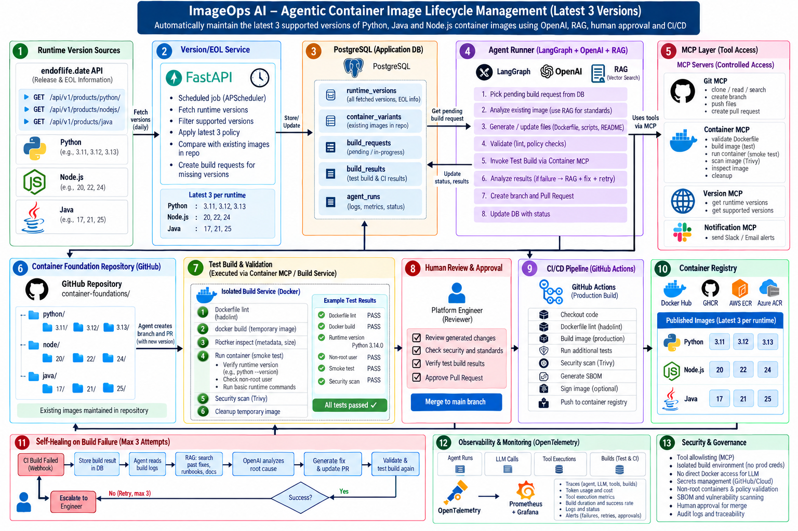

# ImageOps AI - Project explanation 

One of the projects I worked on is ImageOps AI, an Agentic AI-based container image lifecycle management platform.

In our environment, we maintain standardized foundation container images for Python, Java, and Node.js. For each runtime, we maintain the latest three supported versions. For example, if the supported Python versions are 3.11, 3.12, and 3.13, we maintain foundation images for all three.

The challenge was that whenever a new runtime version became available, the platform team had to manually identify it, create or modify the Dockerfile, validate security standards, build and test the image, create a pull request, and monitor the CI/CD pipeline.

We automated this using an Agentic AI architecture built around Python, FastAPI, PostgreSQL, LangGraph, OpenAI, RAG, MCP, Docker, GitHub, CI/CD, and OpenTelemetry.
A scheduled Version/EOL service retrieves runtime lifecycle information and compares the latest three supported versions against the images maintained in our repository. If a version is missing, it creates a build request in PostgreSQL.

A LangGraph agent picks up that request. It uses RAG to retrieve our internal container standards, security policies, runtime-specific instructions, troubleshooting runbooks, and historical fixes. OpenAI uses that context along with existing Dockerfiles to generate the required changes.
The LLM doesn't get direct access to GitHub or Docker. We expose controlled operations through MCP tools. For example, Git MCP handles repository operations and Container MCP delegates test builds to an isolated build service.

Before creating a PR, we perform Dockerfile validation, build a temporary image, run the container, verify the runtime version, perform smoke tests, check non-root execution, and run security scanning.
If everything passes, the agent creates a PR. We keep human approval before merge. After approval, CI/CD independently rebuilds, tests, scans, signs, and publishes the production image to the container registry.

We also implemented a self-healing workflow. If a test or CI build fails, the agent reads the build logs, retrieves relevant troubleshooting knowledge and historical fixes through RAG, asks OpenAI to analyze the root cause, generates a corrective change, validates it, and retries. We limit autonomous retries to three before escalating to an engineer.
Finally, the complete workflow is instrumented using OpenTelemetry so that we can trace agent runs, LLM calls, MCP tool calls, build operations, latency, token usage, failures, and retries.


# Arch Diagram



# Arch Diagram

```text
                    Runtime APIs
                 Python / Java / Node
                         │
                         ▼
                Version/EOL Service
                         │
                  Latest-3 Policy
                         │
                         ▼
                     PostgreSQL
                         │
                  Build Request
                         │
                         ▼
                ┌─────────────────┐
                │ LangGraph Agent │
                └────────┬────────┘
                         │
             ┌───────────┼──────────────┐
             │           │              │
             ▼           ▼              ▼
           OpenAI       RAG             MCP
                         │              │
                         ▼              ├── Git MCP
                    Retriever           ├── Container MCP
                         │              ├── Version MCP
                         ▼              └── Notification MCP
                    Vector DB
                         │
            ┌────────────┼─────────────┐
            ▼            ▼             ▼
        Container     Security     Historical
        Standards     Policies     Build Fixes
            │            │             │
            └────────────┼─────────────┘
                         │
                         ▼
                 Retrieved Context
                         │
                         ▼
                      OpenAI
                         │
                         ▼
                 Generate / Fix
                    Dockerfile
                         │
                         ▼
              Static Validation
              ├── Dockerfile lint
              ├── Policy validation
              ├── Approved base image
              ├── Non-root check
              └── Secret/config checks
                         │
                         ▼
                ┌──────────────────┐
                │    TEST BUILD    │
                │                  │
                │ LangGraph Agent  │
                │        │         │
                │        ▼         │
                │  Container MCP   │
                │        │         │
                │        ▼         │
                │  Build Service   │
                └────────┬─────────┘
                         │
                         ▼
               Isolated Build Environment
                         │
             ┌───────────┼────────────┐
             │           │            │
             ▼           ▼            ▼
         docker       docker        Security
          build         run           Scan
             │           │            │
             │           ▼            │
             │     Runtime Tests      │
             │                         │
             └───────────┬─────────────┘
                         │
                         ▼
                  Test Build Result
                         │
                   ┌─────┴─────┐
                   │           │
                  PASS        FAIL
                   │           │
                   │           ▼
                   │      Build/Test Logs
                   │           │
                   │           ▼
                   │      RAG Retrieval
                   │      ├── Runbooks
                   │      ├── Past fixes
                   │      └── Known issues
                   │           │
                   │           ▼
                   │     OpenAI Analysis
                   │           │
                   │           ▼
                   │      Generate Fix
                   │           │
                   │           ▼
                   │       Validate Again
                   │           │
                   │           ▼
                   │      Test Build Again
                   │
                   │      Max 3 Attempts
                   │           │
                   │      Still Failed?
                   │           │
                   │           ▼
                   │     Human Escalation
                   │
                   ▼
                 Git PR
                   │
                   ▼
             Human Approval
                   │
                   ▼
                  Merge
                   │
                   ▼
                  CI/CD
           Production Image Build
                   │
          ┌────────┼─────────┐
          │        │         │
          ▼        ▼         ▼
       Build     Test     Security Scan
          │        │         │
          └────────┼─────────┘
                   │
              ┌────┴────┐
              │         │
           SUCCESS    FAILURE
              │         │
              ▼         ▼
          Sign Image  Build Logs
              │         │
              ▼         ▼
           Registry   PostgreSQL
                        │
                        ▼
                 Retry Build Request
                        │
                        ▼
                 LangGraph Agent
                        │
                        ▼
                   RAG + OpenAI
                        │
                        ▼
                Root Cause Analysis
                        │
                        ▼
                   Generate Fix
                        │
                        ▼
                  Validate + Test
                        │
                        ▼
                     Fix PR
                        │
                        ▼
                 Human Approval
```

# RAG information Stored

| Category | What to store | Example use |
|---|---|---|
| **1. Container Standards** | Organization Docker/container standards | Generate compliant Dockerfiles |
| **2. Security Policies** | Hardening rules, prohibited patterns, vulnerability policies | Validate generated images |
| **3. Runtime Standards** | Python, Java, Node-specific build instructions | Generate correct runtime image |
| **4. Dockerfile Patterns** | Approved Dockerfile templates/patterns | Use known-good implementation |
| **5. Troubleshooting Runbooks** | Common build/runtime failures and resolutions | Self-healing |
| **6. Historical Build Fixes** | Previous failure → root cause → successful fix | Solve recurring problems |
| **7. Dependency/Package Guidance** | OS/package compatibility knowledge | Resolve apt/package failures |
| **8. CI/CD Runbooks** | Pipeline stages, errors, remediation | Diagnose CI failures |
| **9. Vulnerability Remediation** | CVE remediation guidelines | Fix security scan failures |
| **10. Operational Runbooks** | Build-service/registry/Git/MCP operational procedures | Diagnose platform failures |
| **11. Architecture/Design Docs** | System architecture and service responsibilities | Agent understands boundaries |
| **12. Agent Instructions** | Tool-selection and remediation guidance | Control agent behavior |


## general-container-standards.md might contain:

```
All production foundation images must:

- Run as non-root
- Use approved base images
- Define WORKDIR
- Remove package-manager cache
- Contain required OCI labels
- Use COPY instead of ADD unless justified
- Avoid unnecessary packages
- Not contain embedded credentials
- Define approved filesystem permissions
```

## Security Policies

```
CRITICAL vulnerabilities → build must fail

HIGH vulnerabilities → fail unless exception exists

Secrets inside image → always fail

Root container → fail

Unapproved base image → fail

Privileged container → prohibited
```

## Dangerous patterns:

```
DO NOT:

curl ... | bash
chmod 777
USER root as final user
COPY . .
hardcode passwords
disable TLS verification
download binaries without checksum verification
```

## Runtime-specific standards

```
knowledge/runtimes/

├── python/
│   ├── installation.md
│   ├── configuration.md
│   ├── dependencies.md
│   ├── ssl.md
│   └── troubleshooting.md
│
├── java/
│   ├── installation.md
│   ├── jdk-configuration.md
│   ├── certificates.md
│   ├── jvm-settings.md
│   └── troubleshooting.md
│
└── node/
    ├── installation.md
    ├── npm-configuration.md
    ├── certificates.md
    ├── dependencies.md
    └── troubleshooting.md
```

```
Installation procedure
Required system libraries
pip configuration
Certificate configuration
SSL requirements
Expected python --version output
Smoke tests
Filesystem locations
Environment variables
```

## Approved Dockerfile patterns

```
knowledge/templates/

├── python-foundation-pattern.md
├── java-foundation-pattern.md
├── node-foundation-pattern.md
├── non-root-pattern.md
├── certificate-installation-pattern.md
├── package-installation-pattern.md
└── multi-stage-build-pattern.md
```

## Troubleshooting runbooks

```
knowledge/troubleshooting/

├── docker/
│   ├── build-failure.md
│   ├── network-errors.md
│   ├── permission-errors.md
│   └── filesystem-errors.md
│
├── python/
│   ├── pip-errors.md
│   ├── openssl-errors.md
│   ├── compilation-errors.md
│   └── dependency-errors.md
│
├── java/
│   ├── jdk-install-errors.md
│   ├── certificate-errors.md
│   └── dependency-errors.md
│
├── node/
│   ├── npm-errors.md
│   ├── node-gyp-errors.md
│   └── package-errors.md
│
├── registry/
│   ├── authentication-errors.md
│   └── push-errors.md
│
└── cicd/
    ├── pipeline-failures.md
    └── security-scan-failures.md
```

```
Problem:
Python image build fails installing OpenSSL.

Symptoms:
...

Possible Causes:
1. Package renamed
2. Repository unavailable
3. OS version incompatible
4. Runtime requires newer OpenSSL

Diagnosis:
...

Approved Resolution:
...

Validation:
...

Do NOT:
...
```


# Final RAG structure I'd use

```
imageops-ai/
│
├── knowledge-base/
│
│   ├── container-standards/
│   │   ├── general-standards.md
│   │   ├── approved-base-images.md
│   │   ├── dockerfile-guidelines.md
│   │   └── image-labels.md
│   │
│   ├── security/
│   │   ├── container-security.md
│   │   ├── secrets-policy.md
│   │   ├── vulnerability-policy.md
│   │   ├── sbom-policy.md
│   │   └── prohibited-patterns.md
│   │
│   ├── runtimes/
│   │   ├── python/
│   │   ├── java/
│   │   └── node/
│   │
│   ├── templates/
│   │   ├── python-pattern.md
│   │   ├── java-pattern.md
│   │   └── node-pattern.md
│   │
│   ├── troubleshooting/
│   │   ├── docker/
│   │   ├── python/
│   │   ├── java/
│   │   ├── node/
│   │   ├── registry/
│   │   └── cicd/
│   │
│   ├── historical-fixes/
│   │   ├── python/
│   │   ├── java/
│   │   └── node/
│   │
│   ├── vulnerability-remediation/
│   │
│   ├── cicd/
│   │
│   ├── runbooks/
│   │
│   ├── architecture/
│   │
│   └── agent-guides/
│
└── ...
```


## Scheduler Example

```py
from contextlib import asynccontextmanager

from apscheduler.schedulers.background import BackgroundScheduler
from fastapi import FastAPI


scheduler = BackgroundScheduler()


def check_runtime_versions():
    print("Checking Python, Java and Node.js versions...")

    check_python_versions()
    check_java_versions()
    check_node_versions()


def check_python_versions():
    print("Checking Python versions")


def check_java_versions():
    print("Checking Java versions")


def check_node_versions():
    print("Checking Node.js versions")


@asynccontextmanager
async def lifespan(app: FastAPI):

    scheduler.add_job(
        check_runtime_versions,
        trigger="interval",
        hours=24,
        id="runtime_version_check",
        replace_existing=True
    )

    scheduler.start()

    yield

    scheduler.shutdown()


app = FastAPI(
    title="ImageOps AI - Version Service",
    lifespan=lifespan
)


@app.get("/health")
def health():
    return {
        "status": "UP"
    }
```