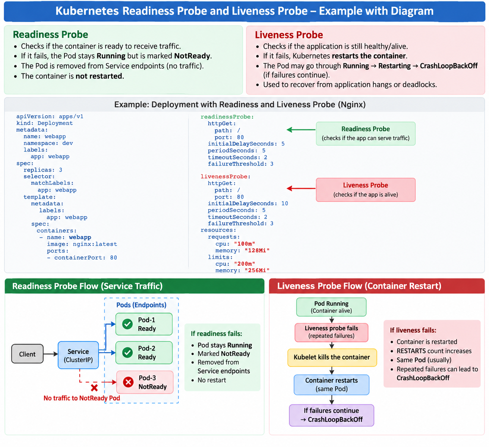
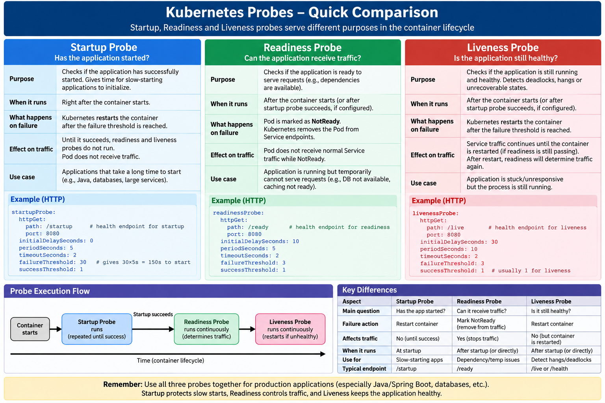

# Probes



```text
Health Probes
│
├── 1. Readiness Probe 
├── 2. Liveness Probe
└── 3. Startup Probe
```

```
Container is RUNNING
        ≠
Application is HEALTHY
```

```text
                 CONTAINER STARTS
                        │
                        ▼
                ┌───────────────┐
                │ STARTUP PROBE │
                │               │
                │ Has the app   │
                │ started?      │
                └───────┬───────┘
                        │
              ┌─────────┴─────────┐
              │                   │
            FAIL                SUCCESS
              │                   │
       keep checking              ▼
              │          ┌──────────────────┐
      threshold reached  │ Normal Operation │
              │          └────────┬─────────┘
              ▼                   │
       RESTART CONTAINER     ┌────┴─────┐
                             │          │
                             ▼          ▼
                       READINESS     LIVENESS
                          PROBE        PROBE
                             │          │
                             ▼          ▼
                        Can receive    Is app
                         traffic?      healthy?
                             │          │
                      ┌──────┴───┐   ┌──┴───────┐
                      │          │   │          │
                    PASS       FAIL PASS       FAIL
                      │          │   │          │
                      ▼          ▼   ▼          ▼
                    Ready    NotReady OK      Restart
                              │
                              ▼
                        No Service
                          traffic
```

### For example, imagine a Spring Boot application:
```text
Container starts
     ↓
Java process starts
     ↓
Pod status = Running
     ↓
Application connecting to DB...
     ↓
Loading configuration...
     ↓
Loading cache...
     ↓
Application finally ready
```

The process could be running for 30 seconds while the application still cannot serve requests.

# Readiness Probe 

```yaml
---
apiVersion: apps/v1
kind: Deployment
metadata:
    name: hpcc-deployment
    namespace: dev
    labels:
        app: hpcc

spec:
    replicas: 3

    strategy:
        type: RollingUpdate
        rollingUpdate:
            maxSurge: 25%
            maxUnavailable: 25%


    selector:
        matchLabels:
            app: hpcc
    
    template:
        metadata:
            labels:
                app: hpcc

        spec:
            containers:
              - name: hpcc-app
                image: nginx:latest
                ports:
                    - containerPort: 80
                readinessProbe:
                    httpGet:
                        path: /
                        port: 80
                    initialDelaySeconds: 5 // Start rediness after 5 sec of container creation
                    periodSeconds: 5 // Run for every 5 seconds
                resources:
                    requests:
                        cpu: "100m"
                        memory: "128Mi"
                    limits:
                        cpu: "200m"
                        memory: "256Mi"

---
apiVersion: v1
kind: Service
metadata: 
    name: hpcc-service
    namespace: dev

spec:
    selector:
        app: hpcc
    
    type: NodePort

    ports:
    - protocol: TCP
      port: 80
      targetPort: 80
      nodePort: 30080
```


# Liveness Probe

```yaml
---
apiVersion: apps/v1
kind: Deployment
metadata:
    name: hpcc-deployment
    namespace: dev
    labels:
        app: hpcc

spec:
    replicas: 3

    strategy:
        type: RollingUpdate
        rollingUpdate:
            maxSurge: 25%
            maxUnavailable: 25%


    selector:
        matchLabels:
            app: hpcc
    
    template:
        metadata:
            labels:
                app: hpcc

        spec:
            containers:
              - name: hpcc-app
                image: nginx:latest
                ports:
                    - containerPort: 80

                readinessProbe:
                    httpGet:
                        path: /
                        port: 80
                    initialDelaySeconds: 5
                    periodSeconds: 5 

                livenessProbe:
                    httpGet:
                        path: /
                        port: 80
                    initialDelaySeconds: 10
                    periodSeconds: 5
                    failureThreshold: 3

                resources:
                    requests:
                        cpu: "100m"
                        memory: "128Mi"
                    limits:
                        cpu: "200m"
                        memory: "256Mi"
```

```shell
NAME                                   READY   STATUS    RESTARTS      AGE
pod/hpcc-deployment-84fc78bb85-7gz8l   1/1     Running   4 (18s ago)   119s
pod/hpcc-deployment-84fc78bb85-k4d69   1/1     Running   4 (18s ago)   119s
pod/hpcc-deployment-84fc78bb85-l9m9t   1/1     Running   4 (18s ago)   119s


NAME                                   READY   STATUS             RESTARTS      AGE
pod/hpcc-deployment-84fc78bb85-7gz8l   0/1     CrashLoopBackOff   4 (12s ago)   2m18s
pod/hpcc-deployment-84fc78bb85-k4d69   0/1     CrashLoopBackOff   4 (12s ago)   2m18s
pod/hpcc-deployment-84fc78bb85-l9m9t   0/1     CrashLoopBackOff   4 (12s ago)   2m18s


NAME                                   READY   STATUS    RESTARTS      AGE
pod/hpcc-deployment-84fc78bb85-7gz8l   0/1     Running   5 (58s ago)   3m4s
pod/hpcc-deployment-84fc78bb85-k4d69   1/1     Running   5 (58s ago)   3m4s
pod/hpcc-deployment-84fc78bb85-l9m9t   1/1     Running   5 (58s ago)   3m4s

NAME                                   READY   STATUS             RESTARTS      AGE
pod/hpcc-deployment-84fc78bb85-7gz8l   1/1     Running            6 (13s ago)   3m39s
pod/hpcc-deployment-84fc78bb85-k4d69   0/1     CrashLoopBackOff   5 (28s ago)   3m39s
pod/hpcc-deployment-84fc78bb85-l9m9t   0/1     CrashLoopBackOff   5 (23s ago)   3m39s

```


```text
                         POD
                          |
                    nginx container
                          |
             +------------+------------+
             |                         |
             v                         v
      Readiness Probe            Liveness Probe
        GET / :80               GET /health :80
             |                         |
        "Can I receive             "Am I alive
          traffic?"                and healthy?"
             |                         |
       +-----+-----+             +-----+-----+
       |           |             |           |
    SUCCESS      FAILURE      SUCCESS      FAILURE
       |           |             |           |
       v           v             v           v
    Ready       NotReady       Nothing    After threshold
       |           |                         |
       v           v                         v
   Service      Service                   Kubelet
   sends        stops                     kills
   traffic      traffic                   container
                   |                         |
                   |                         v
                   |                      Restart
                   |
             Container is
             NOT restarted
```

# Startup Probe

The Startup Probe protects slow-starting applications from liveness checks.

```text
Readiness → "Can I receive traffic?"
Liveness  → "Am I still healthy?"
Startup   → "Has my application finished starting?"
```

```text
Container starts
      ↓
Startup Probe begins
      ↓
      ├── FAIL → keep checking
      ├── FAIL → keep checking
      ├── FAIL → keep checking
      │
      └── SUCCESS
             ↓
       Application started
             ↓
     ┌───────┴────────┐
     ↓                ↓
Readiness          Liveness
starts             starts
     ↓                ↓
Traffic?           Healthy?
```

```yaml
containers:
  - name: hpcc-app
    image: nginx:latest

    ports:
      - containerPort: 80

    startupProbe:
      httpGet:
        path: /
        port: 80
      periodSeconds: 5  // initialDelaySeconds: not added here. because we won't care
      failureThreshold: 12

    readinessProbe:
      httpGet:
        path: /
        port: 80
      periodSeconds: 5
      failureThreshold: 3

    livenessProbe:
      httpGet:
        path: /
        port: 80
      periodSeconds: 10 
      failureThreshold: 3
```