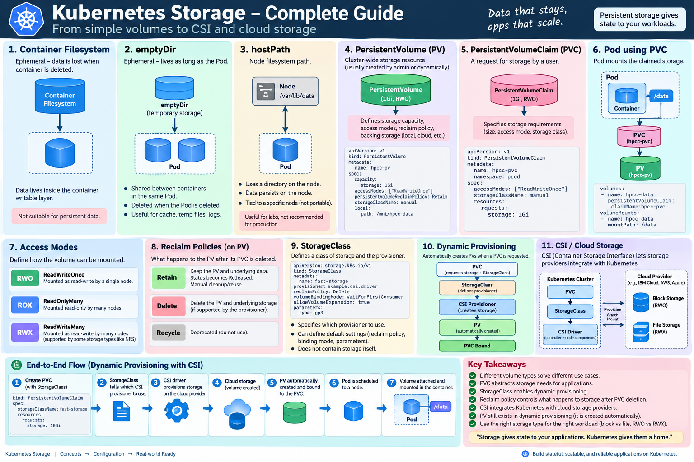

# Storage
 


## emptyDir

emptyDir is Pod-lifetime storage, not persistent storage. Once Pod Recreated then we will loos the data.

```text
Container filesystem
        │
        │ container replaced
        ▼
       lost


emptyDir
        │
        │ container restart
        ▼
     survives

        │
        │ Pod deleted
        ▼
       lost

## So emptyDir is Pod-lifetime storage, not persistent storage. Once Pod Recreated then we will loos the data.
```

```yml
---
apiVersion: apps/v1
kind: Deployment
metadata:
    name: hpcc-deployment
    namespace: prod
    labels:
        app: hpcc

spec:
    replicas: 2

    selector:
        matchLabels:
            app: hpcc
    
    template:
        metadata:
            labels:
                app: hpcc

        spec:
            containers:
              - name: hpcc-app
                image: nginx:latest
                ports:
                    - containerPort: 80

                volumeMounts:
                    - name: hpcc-data
                      mountPath: /data

            volumes:
                - name: hpcc-data
                  emptyDir: {}
```

# hostPath

hostPath is node-local storage, not a proper solution for portable persistent application data.

```yml
worker-1
/opt/hpcc-data/anand.txt
        ↑
      Pod-A

Pod-A deleted
      ↓
Pod-B scheduled on worker-1
      ↓
file available ✅

BUT

Pod-B scheduled on worker-2
      ↓
different /opt/hpcc-data
      ↓
file unavailable ❌
```

```yml
volumes:
  - name: hpcc-data
    hostPath:
      path: /opt/hpcc-data
      type: DirectoryOrCreate
```

# PV(Persistence Volume)

```yml
--- 
apiVersion: v1
kind: PersistentVolume
metadata:
    name: hpcc-pv

spec:
    capacity: 
        storage: 2Gi
    
    accessModes:
        - ReadWriteOnce
    
    persistentVolumeReclaimPolicy: Retain

    storageClass: manual

    local:
        path: /mnt/hpcc-data

    nodeAffinity:
        required:
            nodeSelectorterms:
                - matchExpression:
                    - key: kubernetes.io/hostname
                      operator: In
                      values:
                        - worker-1
```

# PVC (PersistentVolumeClaim)

```yml
apiVersion: v1
kind: PersistentVolumeClaim
metadata:
  name: hpcc-pvc
  namespace: prod

spec:
  accessModes:
    - ReadWriteOnce

  resources:
    requests:
      storage: 1Gi

  storageClassName: manual
```

## Deployment of Application

```yml
---
apiVersion: apps/v1
kind: Deployment

metadata:
  name: hpcc-deployment
  namespace: prod
  labels:
    app: hpcc

spec:
  replicas: 2

  selector:
    matchLabels:
      app: hpcc

  template:
    metadata:
      labels:
        app: hpcc

    spec:
      containers:
        - name: hpcc-app
          image: nginx:latest

          ports:
            - containerPort: 80

          volumeMounts:
            - name: hpcc-data
              mountPath: /data

      volumes:
        - name: hpcc-data
          persistentVolumeClaim:
            claimName: hpcc-pvc
```
    
# accessModes

```text
| Mode   | Full name        | Meaning                       |
| ------ | ---------------- | ----------------------------- |
| `RWO`  | ReadWriteOnce    | Read-write from a single node |
| `ROX`  | ReadOnlyMany     | Read-only from many nodes     |
| `RWX`  | ReadWriteMany    | Read-write from many nodes    |
| `RWOP` | ReadWriteOncePod | Read-write by a single Pod    |
```

# PersistentVolume Reclaim Policy

What should Kubernetes do with the PV/backing storage after its PVC is deleted?

The two policies you should focus on are:

```
Retain
Delete
```

### persistentVolumeReclaimPolicy: Retain

Kubernetes does not automatically make that PV available for another claim and does not automatically remove the underlying data.

```shell
# kubectl get pv
NAME      STATUS     RECLAIM POLICY
hpcc-pv   Released   Retain
```

Released means:

The claim that was using this PV is gone, but Kubernetes hasn't automatically recycled this PV for another claim.

### persistentVolumeReclaimPolicy: Delete

```
PVC deleted
     ↓
PV deleted
     ↓
underlying provisioned storage deleted
```

```
              PVC deleted

Retain                          Delete
   │                               │
   ▼                               ▼
PV/data preserved             PV removed
for manual handling           backing storage
                              deleted when supported
```


# Storage Class

```
PVC
"I need 10Gi"
     ↓
StorageClass
"Use this storage provisioner/configuration"
     ↓
CSI driver / provisioner
     ↓
Actual storage
     ↓
PV
```

```
PVC
"What do I need?"
│
├── 10Gi
├── RWO
└── storageClassName: fast
             │
             ▼
      StorageClass: fast
             │
             ├── Which provisioner?
             ├── Reclaim policy?
             ├── Binding mode?
             ├── Expansion?
             └── Provider-specific parameters
                     │
                     ▼
                 CSI Driver
                     │
                     ▼
              Actual Storage
                     │
                     ▼
                     PV
                     │
                     ▼
                   Bound
                     │
                     ▼
                    PVC
```

```yml
# Create PV
apiVersion: storage.k8s.io/v1
kind: StorageClass
metadata:
  name: fast-storage

provisioner: example.csi.driver

reclaimPolicy: Delete

volumeBindingMode: WaitForFirstConsumer

# Create PVC
apiVersion: v1
kind: PersistentVolumeClaim
metadata:
  name: hpcc-pvc
  namespace: prod
spec:
  accessModes:
    - ReadWriteOnce

  storageClassName: fast-storage

  resources:
    requests:
      storage: 10Gi
```

# Dynamic Provisioning

Dynamic provisioning allows Kubernetes to provision persistent storage automatically when a PVC requests storage through a StorageClass, instead of requiring an administrator to pre-create a PV.

With dynamic provisioning, you normally don't create the PV manually.

```
Developer creates PVC
        ↓
PVC specifies StorageClass
        ↓
StorageClass specifies provisioner
        ↓
CSI provisioner creates storage
        ↓
PV automatically created
        ↓
PVC automatically Bound
        ↓
Pod mounts PVC
```

```yml
# Storage Class
apiVersion: storage.k8s.io/v1
kind: StorageClass
metadata:
  name: hpcc-block-storage
provisioner: <CSI-driver-name>
reclaimPolicy: Delete
volumeBindingMode: WaitForFirstConsumer
allowVolumeExpansion: true

# PVC
apiVersion: v1
kind: PersistentVolumeClaim
metadata:
  name: hpcc-pvc
  namespace: prod
spec:
  accessModes:
    - ReadWriteOnce
  storageClassName: hpcc-block-storage
  resources:
    requests:
      storage: 10Gi
```


