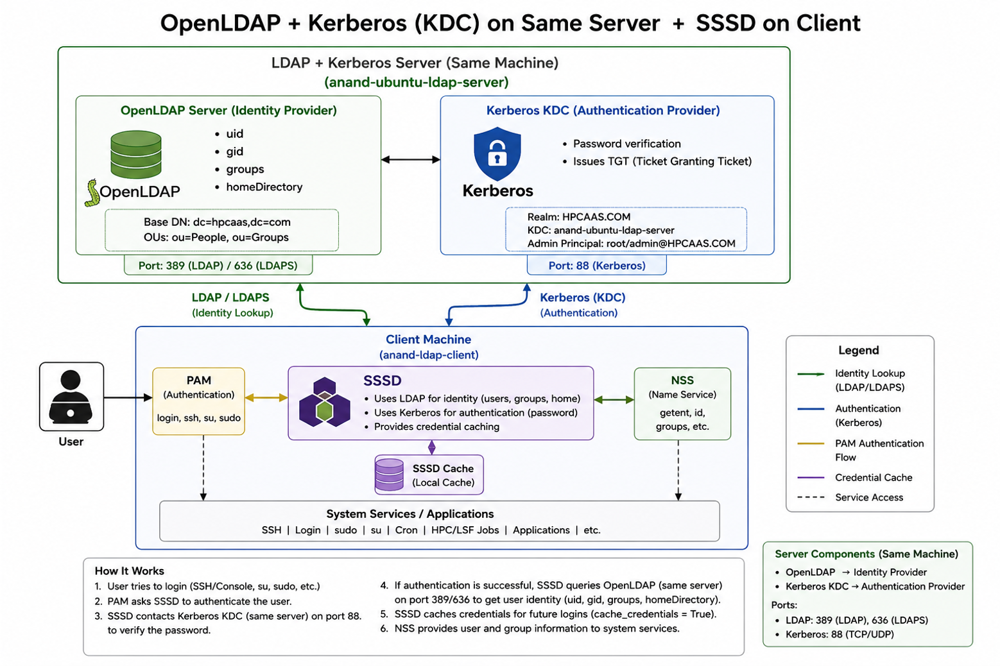

# LDAP

LDAP provides a centralized directory where organizations can store user and group information and allow multiple systems/applications to access that information.

## Advantages of LDAP

- Centralized user management
- Single source of identity
- Scalable : LDAP is designed for directory lookups and can support large numbers of users and systems.
- Centralized authentication/identity integration
    LDAP can integrate with Linux authentication components such as SSSD, PAM, NSS , SSH.
- Group-based access management
- Reduces administration effort

# Open LDAP
LDAP is the protocol, and OpenLDAP is software that implements that protocol and provides a centralized directory service.

```text
                OpenLDAP Server
                ┌──────────────┐
                │    Users     │
                │    Groups    │
                │   UID / GID  │
                │   Attributes │
                └──────┬───────┘
                       │
          ┌────────────┼────────────┐
          │            │            │
       Linux-01     Linux-02     Application
          │            │            │
         SSSD         SSSD       LDAP Client
```

```
OpenLDAP
    └── Identity Provider
         ├── uid
         ├── gid
         ├── groups
         └── homeDirectory

Kerberos KDC
    └── Authentication Provider
         └── password verification

SSSD
    └── Uses LDAP for identity
    └── Uses Kerberos for authentication
    └── Provides credential caching
```

## Architecture



-----------------------------------------

# Installation and Configuration

## Open LDAP Server Installation ( OS : Ubuntu 22.04 )

```shell
# Export below values
LDAP_ADMIN_PASSWORD="xxxxx"
BASE_DN="hpcaas.com"
LDAP_GROUP="hpcaas"
LDAP_USER="anand"
LDAP_USER_PASSWORD="xxxxx"

# kerberos
KERBEROS_REALM="HPCAAS.COM"
LDAP_SERVER_IP="10.244.0.4"

# Install and Configure OpenLDAP server 
export DEBIAN_FRONTEND=noninteractive

apt-get update -y

apt-get install -y \
nfs-common \
gnutls-bin \
ssl-cert \
krb5-kdc \
krb5-admin-server \
krb5-user

# ALL debconf values FIRST
echo "slapd slapd/no_configuration boolean false" | debconf-set-selections
echo "slapd slapd/domain string ${BASE_DN}" | debconf-set-selections
echo "slapd shared/organization string ${BASE_DN}" | debconf-set-selections
echo "slapd slapd/password1 password ${LDAP_ADMIN_PASSWORD}" | debconf-set-selections
echo "slapd slapd/password2 password ${LDAP_ADMIN_PASSWORD}" | debconf-set-selections
echo "slapd slapd/root_password password ${LDAP_ADMIN_PASSWORD}" | debconf-set-selections
echo "slapd slapd/root_password_again password ${LDAP_ADMIN_PASSWORD}" | debconf-set-selections
echo "slapd slapd/internal/adminpw password ${LDAP_ADMIN_PASSWORD}" | debconf-set-selections
echo "slapd slapd/internal/generated_adminpw password ${LDAP_ADMIN_PASSWORD}" | debconf-set-selections
echo "slapd slapd/purge_database boolean false" | debconf-set-selections
echo "slapd slapd/move_old_database boolean true" | debconf-set-selections

# THEN install slapd
apt-get install -y slapd ldap-utils

systemctl restart slapd
systemctl enable slapd

# kerberos
cat >/etc/krb5.conf <<EOF
[libdefaults]
 default_realm = ${KERBEROS_REALM}
 dns_lookup_realm = false
 dns_lookup_kdc = false
 ticket_lifetime = 24h
 renew_lifetime = 7d
 forwardable = true

[realms]
 ${KERBEROS_REALM} = {
  kdc = ${LDAP_SERVER_IP}
  admin_server = ${LDAP_SERVER_IP}
 }

[domain_realm]
 .hpcaas.com = ${KERBEROS_REALM}
 hpcaas.com = ${KERBEROS_REALM}
EOF


mkdir -p /etc/krb5kdc

cat >/etc/krb5kdc/kdc.conf <<EOF
[kdcdefaults]
 kdc_ports = 88

[realms]
 ${KERBEROS_REALM} = {
  database_name = /var/lib/krb5kdc/principal
  admin_keytab = FILE:/etc/krb5kdc/kadm5.keytab
  acl_file = /etc/krb5kdc/kadm5.acl
  key_stash_file = /etc/krb5kdc/stash

  max_life = 24h
  max_renewable_life = 7d

  default_principal_flags = +preauth
 }
EOF

printf "%s\n%s\n" "${LDAP_ADMIN_PASSWORD}" "${LDAP_ADMIN_PASSWORD}" | \
kdb5_util create -s

echo "*/admin@${KERBEROS_REALM} *" > /etc/krb5kdc/kadm5.acl

systemctl enable krb5-kdc
systemctl enable krb5-admin-server

systemctl restart krb5-kdc
systemctl restart krb5-admin-server


kadmin.local -q "addprinc -pw Admin@123 root/admin"


# Generate SSL cert and Configure with OpenLDAP server
certtool --generate-privkey --sec-param High --outfile /etc/ssl/private/ldap_cakey.pem

# Create CA template file
cat <<EOF > /etc/ssl/ca.info
cn = IBM Research
ca
cert_signing_key
expiration_days = 3650
EOF

# Generate a self-signed CA certificate
certtool --generate-self-signed \
--load-privkey /etc/ssl/private/ldap_cakey.pem \
--template /etc/ssl/ca.info \
--outfile /usr/local/share/ca-certificates/ldap_cacert.pem

# Update CA certificates and copy the generated CA certificate to /etc/ssl/certs/
update-ca-certificates
cp /usr/local/share/ca-certificates/ldap_cacert.pem /etc/ssl/certs/

# Generate a private key for the LDAP server
certtool --generate-privkey --sec-param High --outfile /etc/ssl/private/ldapserver_slapd_key.pem

# Create LDAP server certificate template
cat <<EOF > /etc/ssl/ldapserver.info
organization = IBM Research
cn = localhost
tls_www_server
encryption_key
signing_key
expiration_days = 3650
EOF

# Generate a certificate for the LDAP server signed by the CA
certtool --generate-certificate \
--load-privkey /etc/ssl/private/ldapserver_slapd_key.pem \
--load-ca-certificate /etc/ssl/certs/ldap_cacert.pem \
--load-ca-privkey /etc/ssl/private/ldap_cakey.pem \
--template /etc/ssl/ldapserver.info \
--outfile /etc/ssl/certs/ldapserver_slapd_cert.pem

# Set proper permissions for the LDAP server private key
chgrp openldap /etc/ssl/private/ldapserver_slapd_key.pem
chmod 0640 /etc/ssl/private/ldapserver_slapd_key.pem
gpasswd -a openldap ssl-cert

sleep 2

# Restart slapd service to apply changes
systemctl restart slapd.service

# Create LDIF file for configuring TLS in LDAP
cat <<EOF > /etc/ssl/certinfo.ldif
dn: cn=config
add: olcTLSCACertificateFile
olcTLSCACertificateFile: /etc/ssl/certs/ldap_cacert.pem
-
add: olcTLSCertificateFile
olcTLSCertificateFile: /etc/ssl/certs/ldapserver_slapd_cert.pem
-
add: olcTLSCertificateKeyFile
olcTLSCertificateKeyFile: /etc/ssl/private/ldapserver_slapd_key.pem
EOF

# Apply TLS configuration using ldapmodify
ldapmodify -Y EXTERNAL -H ldapi:/// -f /etc/ssl/certinfo.ldif

# Update slapd service to listen on ldaps:// as well
sed -i 's\SLAPD_SERVICES="ldap:/// ldapi:///"\SLAPD_SERVICES="ldap:/// ldapi:/// ldaps:///"\g' /etc/default/slapd

sleep 2

#  Update /etc/ldap/ldap.conf
cat <<EOF > /etc/ldap/ldap.conf
BASE   dc=${BASE_DN%%.*},dc=${BASE_DN#*.}
URI    ldap://localhost
TLS_CACERT /etc/ssl/certs/ldap_cacert.pem
TLS_REQCERT allow
EOF

# Restart slapd service to apply changes
systemctl restart slapd.service

# Creating a Organization Unit ( OU ) called People
echo "dn: ou=People,dc=${BASE_DN%%.*},dc=${BASE_DN#*.}
objectClass: organizationalUnit
ou: People" > ouPeople.ldif

ldapadd -x -D "cn=admin,dc=${BASE_DN%%.*},dc=${BASE_DN#*.}" -w "${LDAP_ADMIN_PASSWORD}" -f "ouPeople.ldif"

# Creating a Organization Unit ( OU ) called Groups
echo "dn: ou=Groups,dc=${BASE_DN%%.*},dc=${BASE_DN#*.}
objectClass: organizationalUnit
ou: Groups" > ouGroups.ldif

ldapadd -x -D "cn=admin,dc=${BASE_DN%%.*},dc=${BASE_DN#*.}" -w "${LDAP_ADMIN_PASSWORD}" -f "ouGroups.ldif"

# Create a Group file 
echo "dn: cn=${LDAP_GROUP},ou=Groups,dc=${BASE_DN%%.*},dc=${BASE_DN#*.}
objectClass: posixGroup
cn: ${LDAP_GROUP}
gidNumber: 5000" > group.ldif

ldapadd -x -D "cn=admin,dc=${BASE_DN%%.*},dc=${BASE_DN#*.}" -w "${LDAP_ADMIN_PASSWORD}" -f "group.ldif"

# Creating LDAP User on the LDAP Server
ldap_hashed_password=$(slappasswd -s "${LDAP_USER_PASSWORD}")

# LDAP | User File
echo "dn: uid=${LDAP_USER},ou=People,dc=${BASE_DN%%.*},dc=${BASE_DN#*.}
objectClass: inetOrgPerson
objectClass: posixAccount
objectClass: shadowAccount
uid: ${LDAP_USER}
sn: ${LDAP_USER}
givenName: ${LDAP_USER}
cn: ${LDAP_USER}
displayName: ${LDAP_USER}
uidNumber: 10000
gidNumber: 5000
userPassword: ${ldap_hashed_password}
gecos: ${LDAP_USER}
loginShell: /bin/bash
homeDirectory: /home/${LDAP_USER}" > users.ldif

ldapadd -x -D "cn=admin,dc=${BASE_DN%%.*},dc=${BASE_DN#*.}" -w "${LDAP_ADMIN_PASSWORD}" -f "users.ldif"

# kerberos
kadmin.local -q "addprinc -pw ${LDAP_USER_PASSWORD} ${LDAP_USER}"

# verify 
kadmin.local -q "listprincs"

# Test Kerberos on Server
echo "${LDAP_USER_PASSWORD}" | kinit ${LDAP_USER}
klist
```


## Open LDAP Client Installation and Configuration on RHEL 8.10

```shell
yum update -y

# dnf -y install openldap-clients sssd sssd-ldap kadminrb5-workstation oddjob-mkhomedir openssl-perl

dnf install -y --nobest \
openldap-clients \
sssd \
sssd-ldap \
krb5-workstation \
oddjob-mkhomedir \
openssl-perl

dnf install -y --nobest krb5-workstation

sed -i 's/PasswordAuthentication no/PasswordAuthentication yes/' /etc/ssh/sshd_config
systemctl restart sshd

vi /etc/openldap/certs/ldap_cacert.pem 

cat >/etc/krb5.conf <<EOF
[libdefaults]
 default_realm = HPCAAS.COM
 dns_lookup_realm = false
 dns_lookup_kdc = false

[realms]
 HPCAAS.COM = {
  kdc = 10.243.0.4
  admin_server = 10.243.0.4
 }

[domain_realm]
 .hpcaas.com = HPCAAS.COM
 hpcaas.com = HPCAAS.COM
EOF

vi /etc/sssd/sssd.conf

[sssd]
config_file_version = 2
services = nss, pam, autofs 
domains = default

[nss]
homedir_substring = /home

[pam]

[domain/default]

id_provider = ldap
autofs_provider = ldap

auth_provider = krb5
chpass_provider = krb5

krb5_server = 10.243.0.4
krb5_realm = HPCAAS.COM

ldap_uri = ldap://10.243.0.4
ldap_search_base = dc=hpcaas,dc=com

ldap_id_use_start_tls = True
ldap_tls_cacertdir = /etc/openldap/certs
ldap_tls_reqcert = allow

cache_credentials = True
enumerate = False


chmod 600 /etc/sssd/sssd.conf
chown root:root /etc/sssd/sssd.conf


vi /etc/openldap/ldap.conf

BASE dc=hpcaas,dc=com
URI ldap://10.243.0.4
TLS_CACERT /etc/openldap/certs/ldap_cacert.pem
TLS_CACERTDIR /etc/openldap/certs

openssl rehash /etc/openldap/certs

authselect select sssd with-mkhomedir --force

systemctl enable sssd.service --now
systemctl enable oddjobd.service --now

systemctl restart sssd.service
systemctl restart oddjobd.service

systemctl status sssd.service 
systemctl status oddjobd.service
```

```text
## Validation of Kerberos

1. Update /etc/sssd/sssd.conf file "krb5_server" with invalid address.

krb5_server = 1.1.1.1


2. Cleared the SSSD cache:


systemctl stop sssd
rm -f /var/lib/sss/db/*
rm -f /var/lib/sss/mc/*
systemctl start sssd


3. Validate the details

getent passwd anand

4. Restore back 

4.1 update back "/etc/sssd/sssd.conf" file 

krb5_server = 10.244.0.4
krb5_realm = HPCAAS.COM


4.2 Restart

systemctl restart sssd
sss_cache -E
```


## LDAP Client configuration on Ubuntu 22.04

```shell
LDAP_SERVER="10.243.0.4"
LDAP_BASE="dc=hpcaas,dc=com"
KERBEROS_REALM="HPCAAS.COM"

sudo apt update

DEBIAN_FRONTEND=noninteractive apt install -y \
    sssd \
    sssd-tools \
    sssd-ldap \
    ldap-utils \
    krb5-user \
    libpam-krb5 \
    libpam-sss \
    libnss-sss \
    openssl

# Update SSH configuration to allow password authentication
sudo sed -i 's/PasswordAuthentication no/PasswordAuthentication yes/' /etc/ssh/sshd_config
sudo sed -i 's/PasswordAuthentication no/PasswordAuthentication yes/' /etc/ssh/sshd_config.d/50-cloudimg-settings.conf
systemctl restart ssh

sudo sed -i '$ i\session required pam_mkhomedir.so skel=/etc/skel umask=0022\' /etc/pam.d/common-session


cat >/etc/krb5.conf <<EOF
[libdefaults]
 default_realm = ${KERBEROS_REALM}
 dns_lookup_realm = false
 dns_lookup_kdc = false
 ticket_lifetime = 24h
 renew_lifetime = 7d
 forwardable = true

[realms]
 ${KERBEROS_REALM} = {
     kdc = ${LDAP_SERVER}
     admin_server = ${LDAP_SERVER}
 }

[domain_realm]
 .hpcaas.com = ${KERBEROS_REALM}
 hpcaas.com = ${KERBEROS_REALM}
EOF

mkdir -p /etc/ldap/certs

cat >/etc/ldap/ldap.conf <<EOF
BASE ${LDAP_BASE}

URI ldap://${LDAP_SERVER}

TLS_CACERT /etc/ldap/certs/ldap_cacert.pem
TLS_CACERTDIR /etc/ldap/certs
EOF

openssl rehash /etc/ldap/certs


cat >/etc/sssd/sssd.conf <<EOF
[sssd]
config_file_version = 2
services = nss, pam, autofs
domains = default

[nss]
homedir_substring = /home

[pam]

[domain/default]

id_provider = ldap
autofs_provider = ldap

auth_provider = krb5
chpass_provider = krb5

krb5_server = ${LDAP_SERVER}
krb5_realm = ${KERBEROS_REALM}

ldap_uri = ldap://${LDAP_SERVER}
ldap_search_base = ${LDAP_BASE}

ldap_schema = rfc2307

ldap_id_use_start_tls = True
ldap_tls_cacertdir = /etc/ldap/certs
ldap_tls_reqcert = allow

cache_credentials = True
enumerate = False
EOF

chmod 600 /etc/sssd/sssd.conf
chown root:root /etc/sssd/sssd.conf

systemctl enable sssd
systemctl restart sssd
```

# Questions

## Expline the complete Open LDAP implementation ?

```
I implemented a centralized identity and authentication solution using OpenLDAP and Kerberos.

OpenLDAP acts as the identity provider and stores users, groups, UID/GID and other POSIX attributes. Kerberos is used for authentication and ticket management.

On the Linux clients, SSSD integrates the operating system with LDAP and Kerberos. SSSD retrieves identity information from LDAP and uses Kerberos for authentication. NSS allows commands such as id and getent to resolve LDAP users, while PAM integrates the authentication process with SSH and other Linux services.

I also configured TLS between the LDAP clients and server so LDAP communication is encrypted.

Finally, I validated the complete flow by logging in with an LDAP user and verifying identity resolution and Kerberos authentication.
```